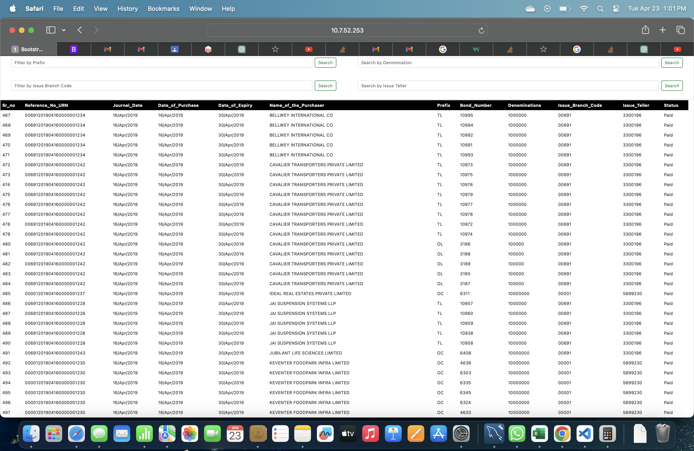
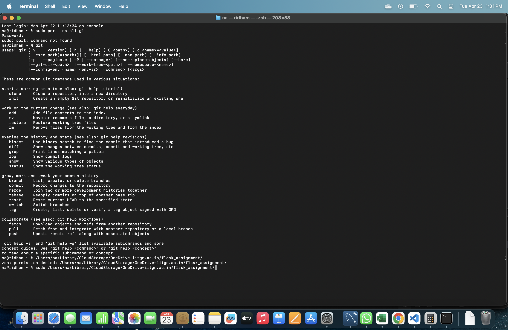

# 23110238-DCC-Assignment-4
**Q1: a)**
With Purchase details:

* Searching by Bond number

* Searching by Reference Number

* Searching by Name of the purchaser

* Searching by Denomination Amount

* Searching by Issue Branch Code

* Searching by Issue Teller

* Searching by different kind of dates

* For Redemption Details

* Searching by Party Name

* Searching by Bond Number

* Searching by Date of Encashment

* Searching by Account Number (Last four digits)

* Searching by Prefix

* Search by Denomination

* Search by Pay Branch Code

* Search by Pay Teller

**Q1 b)**

**Q1 c)**

**Q1 d)**

**Q1 e)**

**Q2 f)**

